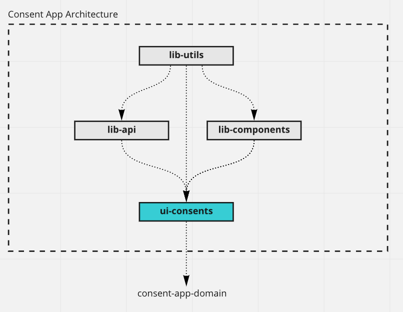

# Consent App (React)

React app to collect consents based on https://github.com/didomi/challenges/tree/master/frontend

## Pipeline status:

[](https://github.com/Akash-M/consent-application-react/actions/workflows/lib-api.yaml)
[](https://github.com/Akash-M/consent-application-react/actions/workflows/lib-components.yaml)
[](https://github.com/Akash-M/consent-application-react/actions/workflows/lib-utils.yaml)
[](https://github.com/Akash-M/consent-application-react/actions/workflows/ui-consents.yaml)

## Prerequisites

### Package Manager

This repo is based on Yarn3. Ensure that you have a global installation of
[Yarn3](https://yarnpkg.com/getting-started/install#global-install). Note: The project uses `pnp` to ensure faster
installation of application dependencies in a monorepo setup.

You can test if yarn is installed correctly by using:

```sh
yarn --version
```

### Step 1: Install dependencies:

```sh
yarn
```

### Step 2: Start the frontend app:

Start `ui-consents` app

```sh
yarn start:frontend
```

### Step 3(Optional): Run storybook to display component library:

Start `lib-components` app

```sh
yarn start:storybook
```

### Step 4: Starting `ui-consents` using Docker

Ensure that docker is running on your machine. Then, run the following script:

```sh
yarn start:docker
```

Once the docker container is built, `ui-consents` app can be accessed on `0.0.0.0:8080/`.

***NOTE:***
If you need to run scripts for individual packages you can use the following commands:

For `ui-consents` package:

```sh
yarn workspace ui-consents start:dev --> to start the frontend app
yarn workspace ui-consents test:unit --> to run the tests
yarn workspace ui-consents lint --> to run the all the linters(eslint, prettier, stylelint)
yarn workspace ui-consents build --> to generate the distributions 
```

For `lib-components` package:

```sh
yarn workspace lib-components start:dev --> to start storybook and render the custom components
yarn workspace lib-components lint --> to run the all the linters(eslint, prettier, stylelint)
yarn workspace lib-components build --> to generate the distributions for storybook
```

For `lib-api` package:

```sh
yarn workspace lib-api lint --> to run all the linters(eslint, prettier)
yarn workspace lib-api test:unit --> to run the tests
```

For `lib-utils` package:

```sh
yarn workspace lib-utils lint --> to run all the linters(eslint, prettier) 
```

### Further documentation:

Please find the documentation specific to the apps inside the app ReadMe linked in the following section:
[lib-api](packages/frontend/lib-api/README.md)
[lib-components](packages/frontend/lib-components/README.md)
[lib-utils](packages/frontend/lib-utils/README.md)
[ui-consents](packages/frontend/ui-consents/README.md)

### Workspace Structure

This application follows a monorepo approach. The following sections explains the folder structure:

- `./.github/`: PR templates and Github Action definitions.
- `./.yarn/`: Dependencies installed from yarn2.
- `./packages/`: TypeScript applications defined as independent modules.
    - `frontend/`: Folder containing the frontend application and related code.
        - `lib-api`: Library of global api calls. Consists of mocked api calls for sake of demo.
        - `lib-components`: Library of global generic components independent of application specific logic.
        - `lib-utils`: Library of global utility files.
        - `types`: Global type definitions for frontend folder.
        - `ui-consents`: The Consents client app which is the final deliverable.
- `./`
    - `.eslintrc.js`: The global ESLint rules.
    - `.gitignore`: File and folder globs to be ignored by git.
    - `.yarnrc.yml`: Config file for yarn3.
    - `package.json`: The node package definition, with packages links and scripts.
    - `yarn.lock`: Auto generated lock file from yarn.
    - `jest.*.js`: Global jest config for testing.
    - `.prettier`: Config containing prettier files.
    - `.pnp.*`: Autogenerated files containing dependency instructions for yarn3 plug and play.
    - `.yarnrc.yml`: File to specify the dependency tree explicitly. Only required for specific packages.
    - `.tsconfig.*`: Global typescript configuration.
    - `webpack.*`: Global webpack configuration.

### Application Architecture:



### Future Improvements:

- Filter for @mui DataGrid is not responsive due to open issue in the library:
  https://github.com/mui-org/material-ui-x/issues/883
